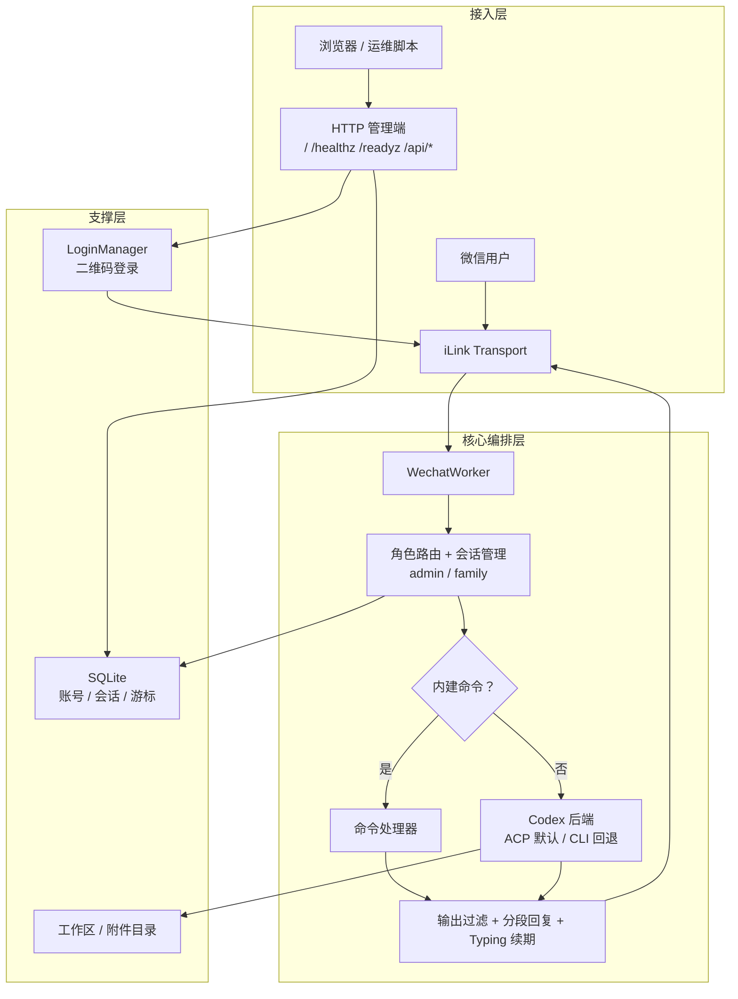

# weixin-household-gateway

家庭共享微信 AI 网关：支持多名用户在微信的 openclaw 里和 AI 聊天，管理员拥有 `admin` 高权限身份，其他用户只拥有`family`权限。
本项目不会走复杂agent助手那一类（openclaw等），只是借用了codex cli的能力，然后把使用入口选在了常见的wx聊天中。

## 一键安装

用普通登录用户 SSH 到服务器（不要 `sudo su -`）：

```bash
curl -fsSL https://raw.githubusercontent.com/thekfjie/weixin-household-gateway/main/infra/scripts/linux/bootstrap.sh | bash
```

安装器会拉代码到 `/opt/weixin-household-gateway`，检测环境并补装依赖，然后构建、写入 `.env` 和 systemd 服务。首次安装会停在终端二维码，扫码确认后继续启动。

**无交互模式**（所有选项走默认值）：

```bash
curl -fsSL https://raw.githubusercontent.com/thekfjie/weixin-household-gateway/main/infra/scripts/linux/bootstrap.sh | \
BOOTSTRAP_YES=1 \
CODEX_CLI_AUTH_MODE=api_key \
CODEX_CLI_BASE_URL=https://你的第三方兼容服务/v1 \
CODEX_CLI_API_KEY=sk-... \
bash
```

> 未提供完整 `BASE_URL/API_KEY` 时会自动回退到 `login` 模式。

## 快速开始

### 1. 扫码绑定管理员

安装器首次运行时会在终端停下来，显示微信二维码。扫码确认后，这个账号会绑定为 `admin`。

### 2. 配置 Codex

安装器交互时会提示填入 API Key。安装完成后验证连通性：

```bash
cd /opt/weixin-household-gateway
node dist/apps/server/doctor.js --acp-session
```

如果后续调整了 API 配置，重新生成 Codex CLI 配置：

```bash
node dist/apps/server/configure-codex.js --apply
sudo systemctl restart weixin-household-gateway
```

### 3. 添加家人

首次扫码账号默认是 `admin`。添加家人：

```bash
node dist/apps/server/setup.js family --force
sudo systemctl restart weixin-household-gateway
```

### 4. 日常运维

```bash
# 查看服务状态
sudo systemctl status weixin-household-gateway
journalctl -u weixin-household-gateway -f

# 更新
cd /opt/weixin-household-gateway && git pull && corepack pnpm build
sudo systemctl restart weixin-household-gateway

# 备份 / 恢复
node dist/apps/server/backup.js
node dist/apps/server/backup.js --restore /path/to/backup --yes

# 卸载（保留数据）
bash infra/scripts/linux/uninstall.sh --yes --keep-data
# 彻底卸载
bash infra/scripts/linux/uninstall.sh --yes
```

## 架构



主链路现在收敛成“接入 -> 编排 -> 回复”一条线，HTTP 管理和存储能力单独放到旁路，便于快速看清消息从哪里进入、在哪里决策、最终怎么回到微信。

HTTP 管理端的路由和登录状态管理集中在 `apps/server/src/http/`，入口文件只保留启动、日志和优雅退出。

## 目录结构

```text
/opt/weixin-household-gateway          项目代码和构建产物
/var/lib/weixin-household-gateway      数据（SQLite、附件、工作区文件）
  ├── inbox/                           入站文件下载
  ├── office/                          处理中间文件
  └── outbox/                          成品文件（可发回微信）
/home/<user>/.codex                    Codex 配置和认证
```

## 核心能力

- 多微信账号，admin/family 分权
- ACP 会话映射（支持跨重启恢复），CLI 作为回退
- 会话自动轮转（空闲/轮数/token/跨天）
- 北京时间上下文锚点
- family 输出过滤（隐藏路径、命令、内部信息）
- 文件收发：入站下载解密、白名单发送、CDN 上传
- 长回复分段、typing 续期、长耗时提示
- doctor 自检、数据备份/恢复、安装前环境恢复

## 更多文档

- [Codex 配置](docs/codex-setup.md)
- [微信命令明细](docs/commands.md)
- [Windows 本地测试](docs/windows-local-test.md)

## 友链

- [linux do社区](https://linux.do/)
