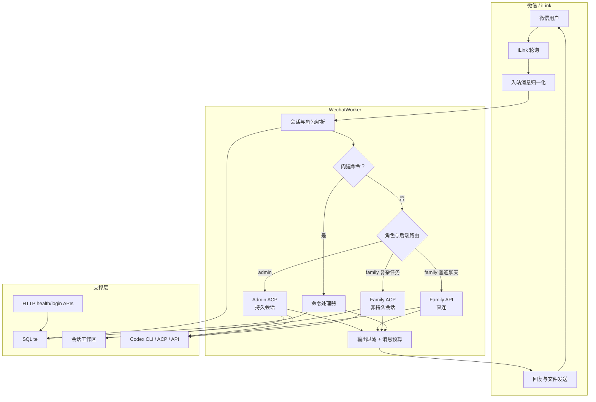

# weixin-household-gateway

本项目 `weixin-household-gateway` 是一个基于 TypeScript/Node.js 的微信家庭 AI 网关。
它整合 iLink 微信消息轮询、角色路由、Codex 后端、本地文件工作区和适合微信聊天的输出策略，形成一个可部署的单服务。

项目目标不是把完整网页 agent 产品照搬进微信，而是在微信这个消息环境里提供一个可靠、可控、分权的 AI 入口：

- `admin` 拥有持久 ACP 会话，适合运维、代码、文件和长任务。
- `family` 默认走更安全的路径：普通聊天优先直连 API，复杂文件任务再升级到非持久 ACP，并受更严格的权限策略约束。

## 项目能力

- 多微信账号接入，支持 `admin` / `family` 角色分权。
- iLink 轮询、typing 状态续期、文本回复、附件下载、文件回传。
- `family` 普通聊天优先直连 API：
  - 优先 `/responses`；
  - 不支持时回退 `/chat/completions`；
  - 支持约 100k 字符预算的 family API 上下文轨道、稳定 prompt cache key 和图片/文本附件输入。
- ACP 工具型后端：
  - `admin` 使用持久 ACP 会话；
  - `family` 使用非持久 ACP 会话；
  - 收集 ACP status、工具进度、可见文本 run，并提取最终回答。
- 微信友好的输出体验：
  - 单轮可见消息预算；
  - 最终回答固定作为最后一条发送；
  - 可配置 ACP 过程输出；
  - 可配置 `family-api` 保守提前发送；
  - `family` 输出过滤路径、命令片段和疑似内部推理文本。
- 角色化提示词和上下文策略：
  - `admin` 默认依赖持久 ACP 会话；
  - `family-api` 维护约 100k 字符预算的独立 API 上下文轨道；
  - `family-acp` 只带 deterministic carryover、短尾巴和当前任务信息；
  - 默认提示词放在 `prompts/` 目录，可通过环境变量指向自定义模板。
- 会话自动轮转：空闲时间、轮数、估算 token 和北京时间跨天。
- SQLite 存储账号、会话、消息、附件和轮询游标。
- 会话工作区：`inbox` 入站文件、`office` 中间文件、`outbox` 可回传成品。
- 运维工具：doctor 自检、备份/恢复、账号设置、Codex 配置生成、文件发送。

## 架构概览



主链路：

```text
iLink updates -> WechatWorker -> 角色/后端路由 -> Codex backend
  -> 输出策略 -> iLink 消息发送 -> SQLite 会话/消息更新
```

## 后端路由

| 角色/场景 | 默认后端 | 会话持久性 | 典型用途 |
| --- | --- | --- | --- |
| `admin` | ACP | 持久 | 运维、代码、多步骤工具任务 |
| `family` 普通聊天 | API | 非持久 | 日常对话、轻量问答 |
| `family` 复杂任务 | ACP | 非持久 | 压缩包、文档、复杂附件、工具任务 |

`family` 普通文本和图片聊天优先走 direct API。压缩包、Office 文档等复杂附件会升级到 ACP，让 Codex 在受控工作区里处理文件。

## 输出模型

微信不支持原地 token 级流式刷新，所以项目使用微信原生的多消息体验：

- 单轮可见消息预算由 `WECHAT_TURN_MESSAGE_LIMIT` 控制，默认 10 条；
- 预算中的最后 1 条固定留给最终回答；
- 前 `N-1` 条用于 ACP 过程输出、30 秒思考提示或 `family-api` 早发；
- 过程输出指 Codex 对外可见的阶段性说明和工具调用进度；
- `admin-acp` 默认开启过程输出；
- `family-acp` 默认关闭过程输出；
- `family-api` 提前分段默认关闭，可按会话开启；
- 用户可用 `/output` 调整当前会话输出行为。

| 模式 | 默认过程输出 | 30s 思考提示 | 过程/分段限制 |
| --- | --- | --- | --- |
| `admin-acp` | 开 | 关闭 | 最多占用前 `N-1` 条，至少间隔 15 秒；发送 `visible_message_run` 和工具进度 |
| `family-acp` | 关 | 开 | 默认不发 ACP 过程；开 `/output process on` 后最多 4 条且不超过前 `N-1` 条，至少间隔 8 秒，只发可见文本块，不发工具进度 |
| `family-api` | 早发默认关 | 开 | 开 `/output family-api-stream on` 后最多提前发 2 条且不超过前 `N-1` 条，至少 60 字，至少间隔 2.5 秒，只在强边界切 |

`family-api` 未开启早发时，会等 API 完整返回后再发最终回答。最终回答默认作为
一条完整消息发送，不再做普通长度分段；如果前面已发送了 9 条过程消息，默认配置
下第 10 条就是最终回答。

`family-api` 维护独立的 API 聊天轨道，不把 ACP 工具任务的长过程直接混入 API
上下文；这条轨道约有 100k 字符预算，超出后优先按完整旧轮次裁剪，尽量保持
缓存前缀稳定。ACP 完成后只把最后可见答案作为 task note 交回 API 轨道，同样受
100k 字符预算约束，避免复杂文件任务结束后把有效结论压得过短。prompt cache key 按
账号和联系人稳定生成，避免新 session 直接打散缓存。当前兼容 HTTP `/responses`
接口不支持 `previous_response_id` 连续上下文，所以项目不会依赖该字段。

默认配置：

```dotenv
WECHAT_TURN_MESSAGE_LIMIT=10
WECHAT_ADMIN_PROGRESS_ENABLED=true
WECHAT_FAMILY_PROGRESS_ENABLED=false
WECHAT_FAMILY_API_STREAMING_ENABLED=false
```

ACP 事件、`final_message_run`、过程输出限制和开发注意事项见
[ACP 工作流](docs/acp-workflow.md)。

角色提示词、上下文注入和缓存策略见 [提示词与上下文策略](docs/prompting.md)。

## 目录结构

```text
apps/server/src/
  codex/        Codex 后端、ACP 连接、ACP collector、API backend
  commands/     微信内建命令
  config/       环境变量驱动的运行配置
  files/        MIME 推断和文件工具
  http/         health、ready、登录与账号 API
  policy/       family 输出过滤与敏感信息处理
  router/       账号角色解析
  sessions/     会话 memory、轮转、工作区路径和时间工具
  storage/      SQLite schema 与数据库封装
  transport/    iLink transport、worker、媒体和文件处理
  utils/        通用工具

docs/           运维与开发文档
infra/          Linux 安装/卸载脚本和 systemd 集成
```

常见部署目录：

```text
/opt/weixin-household-gateway          项目代码和构建产物
/var/lib/weixin-household-gateway      SQLite 数据、附件和工作区
  inbox/                              入站文件
  office/                             中间文件
  outbox/                             可发回微信的成品文件
~/.codex                              Codex CLI 配置和认证
```

## 安装

建议使用普通登录用户安装，不要在 `sudo su -` 后安装。

```bash
curl -fsSL https://raw.githubusercontent.com/thekfjie/weixin-household-gateway/main/infra/scripts/linux/bootstrap.sh | bash
```

无交互安装示例：

```bash
curl -fsSL https://raw.githubusercontent.com/thekfjie/weixin-household-gateway/main/infra/scripts/linux/bootstrap.sh | \
BOOTSTRAP_YES=1 \
CODEX_CLI_AUTH_MODE=api_key \
CODEX_CLI_BASE_URL=https://your-openai-compatible-endpoint/v1 \
CODEX_CLI_API_KEY=sk-... \
bash
```

安装器会检测环境、安装运行依赖、构建服务、写入 `.env`、创建 systemd 服务，并
在首次绑定时显示微信二维码。第一个扫码账号会成为 `admin`。

Linux 部署时，安装器会处理 Codex CLI、`bubblewrap`/`bwrap` 兼容和 admin 运维沙箱参数；细节见
[Codex 配置](docs/codex-setup.md)。

## 开发

要求：

- Node.js `>=22.5.0`
- pnpm `10.13.1`

常用命令：

```bash
corepack enable
pnpm install
pnpm build
pnpm check
pnpm start
```

服务构建命令：

```bash
tsc -p apps/server/tsconfig.json
```

部署后的常用工具：

```bash
node dist/apps/server/doctor.js --acp-session
node dist/apps/server/configure-codex.js --apply
node dist/apps/server/setup.js family --force
node dist/apps/server/backup.js
```

## 运维

```bash
sudo systemctl status weixin-household-gateway
journalctl -u weixin-household-gateway -f

cd /opt/weixin-household-gateway
git pull
corepack pnpm build
node dist/apps/server/configure-codex.js --apply
sudo systemctl restart weixin-household-gateway
```

备份和恢复：

```bash
node dist/apps/server/backup.js
node dist/apps/server/backup.js --restore /path/to/backup --yes
```

卸载：

```bash
bash infra/scripts/linux/uninstall.sh --yes --keep-data
bash infra/scripts/linux/uninstall.sh --yes
```

## 相关文档

- [Codex 配置](docs/codex-setup.md)
- [ACP 工作流](docs/acp-workflow.md)
- [提示词与上下文策略](docs/prompting.md)
- [微信命令](docs/commands.md)
- [Windows 本地测试](docs/windows-local-test.md)

## 友链/社区

- [linux.do](https://linux.do/)
